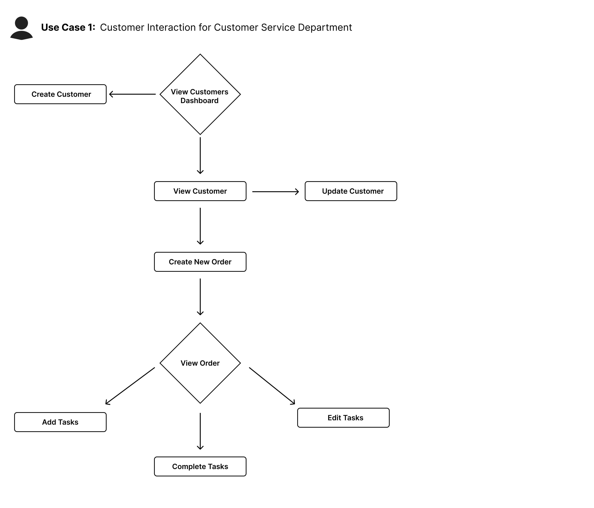

# Spider CRM
My goal with this project is to experiment with different technologies, paradigms, and software development approaches.
I especially want to practice object oriented design in the context of a fullstack web app. Additionally, I also want to practice my UI/UX design and project management skills. I'll be more deliberate and organized with this project as a way for me to explore and practice product management from design to development.

For this project, I will:
- Craft user personas and use cases to inform product decisions
- Plan out a roadmap of features, components, and tasks
- Design low-fidelity wireframes as an initial proof of concept
- Begin development from an API-first approach before moving onto the frontend
- Rapidly develop an initial prototype
- Iterate and make changes to the roadmap
- Develop a style guide to inform the look and feel of the frontend
- Design high-fidelity designs for the final product
- Build a functional full-stack product
- Test and review the application

The reason I chose to build a CRM is for various reasons. Firstly, it is because I have an interest in enterprise software. I want to become proficient in creating technological value for businesses and I figured this is a good side project for that goal.
Secondly, CRMs are good businesses. The recurring revenue that comes from high-value clients leads to a massive life-time value per customer. Though the competition in the CRM space is comically difficult, if I ever choose to enter it, I'd have gained product/development insights from this project.

My intention for this project is to learn and practice my skills across the board. CRMs can be very robust and complicated pieces of software. There is a million directions I could go in with this project. For the sake of simplicity, I will be developing the absolute minimum core features of a B2B CRM. I will not bother with integrations or customizations as this project is not going into production, it is simply an exploration of different ways to build software and the process of doing so.

I think software should be developed in the context of the problem it solves, so I'll begin this project by creating a case that provides the context to inform my development.

## Persona
HydroTech Imports Co. is an established company that imports and distributes water pumps, casings, and generators. The company has carved a niche in bridging international manufacturing with the local market's needs, focusing on the industrial, agricultural, and residential sectors.

The company's operations revolve around sourcing materials and products to meet the demands of the agriculture, manufacturing, and real estate industries. Additionally, HydroTech competes in tenders to win contracts for large scale projects in both the private and the public sector.

The company employees roughly 100 people whose job functions range from engineering to sales and marketing. 
As HydroTech's operations scale, they've been struggled to manage and keep track of their customer data. In addition to incoming deals, HydroTech also has to keep up with previous customer relationships for processing orders and managing projects.
They're seeking a solution for these problem so that they can remain organized and provide satisfactory service for their customers.

This solution will be a CRM with project management capabilities that will used by HydroTech's management, customer service, and sales team for managing client relations, work flows, and tasks. 

The three main use cases are as follows:

1. Customer Interaction and Data Entry
    - Process new orders and service requests.
    - Enter new customer information.
    - View existing customer information.
    - Update customer profiles with recent interactions, inquiries, or feedback.
2. Project Management:
    - Create and assign tasks for current orders to relevant departments.
    - View and complete current tasks.
    - View and complete orders.
3. Reporting and Analytics:
    - View customer information and history.
    - View sales data.
    - View order history.

## Use Cases
With the persona, problem, and use cases scoped out, my next steps are to translate them into features, components, and a mapped out user journey. By reducing the abstractions of the use cases to a granular level, I can have a specific and tangible reference for developing the data layer, frontend, and interactions of all the components of the CRM.

I'll assign an identifier for each use case and expand upon the users actions, the system behavior, and the components related to it.
The users in these cases are the sales, customer service, and management team of HydroTech, with the customers being their clients.

### Use Case 1: Customer Interaction and Data Entry

**1.a) Creating New Orders and Service Requests**
When a customer calls for a new order, whether its for purchasing new products or for a service request, the user would create a new order in the system. 
Each ORDER would include:
 - Customer data - Selecting a preexisting customer, or creating a new one
 - Order Type - If its a service request or a product purchase
 - Items ordered
 - Quantity ordered
 - Unit price
 - Total price
 - Date Created
 - Status - The current status of the order
 - Tasks - The tasks associated with that order
 - Details - A section to type notes regarding the order
 - Delivery Date

**1.b) Entering New Customer Information**

When a new customer interacts with the company, the user will enter the customers data into the system.
Each CUSTOMER would include:
- Company Name
- Contact Name
- Phone Number
- Email
- Stage - The stage the customer is at within the sales cycle (prospect, qualified lead, closed, etc)
- Orders
- Date 
- Location
- Tags
- Details - A section to type notes regarding the customer

**1.c)Viewing Singular Customer Information**

Users will be able view individual customer information that will display their data including orders.

**1.d) Updating Customer Information**

If a change occurs or the customer moves along the sales stages, the user will update that information accordingly in the system.

### Use Case 2: Project Management
**2.a) Creating and Assigning Tasks**

After a new order has been created in the system, the user can create tasks for that order and assign it to specific individuals or departments.

Each TASK will include:
- Task Name
- Order
- Status (Not Started, In Progress, Completed)
- Assignee
- Priority (Low, Medium, High)
- Deadline
- Details - A section to type notes regarding that task

**2.b) Viewing All Tasks and Orders**

Users can view all tasks and orders in the system and sort or filter them however they need to. 

TASKS can be sorted or filtered by:
- Status
- Order
- Assignee
- Priority
- Deadline

ORDERS can be sorted or filtered by:
- Company
- Date
- Type
- Delivery Date
- Total Price
- Status

**2.c) View Singular Order**

Users can also view an individual order and all the tasks associated with it.

**2.d) Completing or Editing Tasks**

Users can edit a task or change the status of it. Task statuses would be:
- Not Started
- In Progress
- Complete

The changes in status of a TASK also contribute to the status of an order. If all tasks are complete for a given order, then that orders status also changes.

Additonally, users can also change the status of an order directly.
- Not Started
- In Progress
- Complete

### Use Case 3: Reporting and Analytics
**3.a) Viewing All Customer Information**

Users will be able to view all their customers in one table.
They will also be able to filter and sort their customers by:
- Stage
- Date
- Orders
- Tags
- Revenue Generated

**3.b) Viewing Sales Data and Order History**

Users can view their total revenue, receivable revenue, and the orders associated with them.

## Database Schemas
Now that the use cases are granularized, I have a much clearer idea of the data the system will be handling. I can now plan the schemas and API endpoints that will be the backbone of the CRM.

### Customer Schema
- customerID - String
- companyName - String
- contactName - String
- phoneNumber - String
- email - String
- stage - Enum {
    PROSPECTING,
    QUALIFIED,
    PRESENTING,
    PROCESSING,
    CLOSED_WON,
    CLOSED_LOST
}
- orders - Array of Orders orderID
- date - Date 
- tags - Array of Strings
- location - String
- details - String

### Order Schema
- orderID - String
- customerID - Customer customerID
- orderType - Enum {
    PRODUCT_PURCHASE
    INSTALLATION,
    MAINTENANCE,
    CONSULTATION,
    CUSTOM_SERVICE
}
- status - Enum {
    NOT_STARTED,
    IN_PROGRESS,
    COMPLETED,
    CANCELLED
}
- items - Json {
    {
        itemName: String,
        quantity: Int,
        unitPrice: Int
    },
    ...
}
- serviceFee - Int
- tasks - Array of Tasks
- details - String
- delivery - String

### Task Schema
- taskID - String
- orderID - Order orderID
- status Enum {
    NOT_STARTED,
    IN_PROGRESS,
    COMPLETED
}
- assignee - String
- priority - Enum {
    LOW,
    MEDIUM,
    HIGH
}
- deadline - String
- details - String

## API Endpoints
Since the schemas are now defined, the next step in fleshing out the data layer is to plan out the logic of the use cases and design the API. Each use case has a direct impact on the data and will have an API endpoint to match it. The table below will help me to organize each use case into an endpoint.

| Use Case ID | Description                                | Resources   | Method | Endpoint         |
|-------------|--------------------------------------------|-------------|--------|------------------|
| 1.a         | Creating New Orders and Service Requests   | ORDER, TASK | POST   | /orders          |
| 1.b         | Entering New Customer Information          | CUSTOMER    | POST   | /customers       |
| 1.c         | Viewing Singular Customer Information      | CUSTOMER    | GET    | /customers/:id   |
| 1.d         | Updating Customer Information              | CUSTOMER    | PUT    | /customers/:id   |
| 2.a         | Creating and Assigning Tasks               | ORDER, TASK | POST   | /orders/:id/tasks|
| 2.b         | Viewing All Tasks and Orders               | ORDER, TASK | GET    | /orders          |
| 2.c         | View Individual Orders                     | ORDER, TASK | GET    | /orders/:id      |
| 2.d         | Completing Tasks                           | TASK, ORDER | PUT    | /tasks/:id       |
| 3.a         | Viewing All Customer Information           | CUSTOMER    | GET    | /customers       |
| 3.b         | Viewing Sales Data and Order History       | ORDER       | GET    | /orders/sales    |

I'll outline the inputs, logic, and outputs of each endpoint. Additionally, I'll also brainstorm UI components that will correspond with the endpoints. After this, I'll be ready to begin development.

### 1.a Create a New Order
**Endpoint: /orders**

**Method: POST**

**Input:**
- Order data
- Task data in an array

**Logic:**
- The endpoint will process the order data and create a new Order in the database.
- It will then return the order ID, loop through the task data array, and create a Task in the database for each item of the array.
- If the operation succeeds, the endpoint returns the order ID which then prompts the client to redirect to the /orders/:id endpoint, which corresponds with the order ID.
- If the operation fails, the endpoint returns the appropriate status code which displays an error message on the client.

**Output:**
- Order ID

**UI Components**
- Order data form 
- Tasks form

### 1.b Create a New Customer
**Endpoint: /customers**

**Method: POST**

**Input:**
- Customer data

**Logic:**
- The endpoint will process the customer data and create a new Customer in the database.
- If the operation succeeds, the endpoint returns the customer ID which then prompts the client to redirect to the /customer/:id endpoint, which corresponds with the customer ID.
- If the operation fails, the endpoint returns the appropriate status code which displays an error message on the client.

**Output:**
- Customer ID

**UI Components**
- Customer data form 

### 1.c View Singular Customer Information
**Endpoint: /customers/:id**

**Method: GET**

**Input:**
- Customer ID

**Logic:**
- The endpoint will find the customer in the database by the customer ID
- If the operation succeeds, the endpoint will return the customer data to be rendered on the client
- If the operation fails, the endpoint returns the appropriate status code which displays an error message on the client.

**Output:**
- Customer Data

**UI Components**
- Customer page
- Customer information card

### 1.d Updating Customer Information
**Endpoint: /customers/:id**

**Method: PUT**

**Input:**
- Updated Customer data

**Logic:**
- The endpoint will find the customer in the database by the customer ID, then replace it with the updated customer data.
- If the operation succeeds, the endpoint will return the customer information.
- If the operation fails, the endpoint returns the appropriate status code which displays an error message on the client.

**Output:**
- Customer information

**UI Components**
- Customer page
- Customer data form

### 2.a Creating and Assigning Tasks
**Endpoint: /orders/:id/tasks**

**Method: POST**

**Input:**
- Task form data
- Order ID

**Logic:**
- The endpoint will process the task form data and create a new Task in the database with the corresponding order ID
- If the operation succeeds, the client will rerender the page
- If the operation fails, the endpoint returns the appropriate status code which displays an error message on the client.

**Output:**
- None

**UI Components**
- Order page
- Task entry form

### 2.b Viewing All Tasks and Orders
**Endpoint: /orders**

**Method: GET**

**Input:**
- None

**Logic:**
- The endpoint will fetch all Order IDs in the database
- If the operation succeeds, the endpoint will return the Order IDs for the client to render
- If the operation fails, the endpoint returns the appropriate status code which displays an error message on the client.

**Output:**
- Array of Order IDs

**UI Components**
- Orders dashboard page
- Order card component
- Task card

### 2.c View Individual Orders
**Endpoint: /orders/:id**

**Method: GET**

**Input:**
- Order ID

**Logic:**
- The endpoint will fetch the order by its ID in the database
- If the operation succeeds, it will return the order data and the client will render it on the page
- If the operation fails, the endpoint returns the appropriate status code which displays an error message on the client.

**Output:**
- Order Data

**UI Components**
- Order page
- Order information card
- Task card

### 2.d Completing or Editing Tasks
**Endpoint: /tasks/:id**

**Method: PUT**

**Input:**
- Task ID
- Updated task data

**Logic:**
- The endpoint will fetch the task by its ID in the database and replace it with the updated data
- If the operation succeeds, it will prompt the client to rerender the page
- If the operation fails, the endpoint returns the appropriate status code which displays an error message on the client.

**Output:**
- None

**UI Components**
- Order page
- Order information card
- Task card
- Task entry form

### 3.a Viewing All Customer Information
**Endpoint: /customers**

**Method: GET**

**Input:**
- None

**Logic:**
- The endpoint will fetch all customer IDs from the database
- If the operation succeeds, it will return the customer IDs in an array for the client to render
- If the operation fails, the endpoint returns the appropriate status code which displays an error message on the client.

**Output:**
- Array of Customer IDs

**UI Components**
- Customers dashboard
- Customer information card

### 3.b Viewing Sales Data and Order History
**Endpoint: /orders/sales**

**Method: GET**

**Input:**
- None

**Logic:**
- The endpoint will select the IDs, items, status, and service fees of all orders from the database
- It will loop through and calculate total revenue and receivable revenue
- If the operation succeeds, it will return the IDs, total revenue, and receivable revenue for the client to render
- If the operation fails, the endpoint returns the appropriate status code which displays an error message on the client.

**Output:**
- Order IDs
- Total Revenue
- Receivable Revenue

**UI Components**
- Sales dashboard
- Order information card

## Pre-Development Checkpoint
Now that I have my API and database schemas defined, I'm ready to begin development. However, there are certain considerations I've had throughout the course of planning the data layer up to this point. 

Firstly, the way the endpoints are organized is by the use case and not the resource they're accessing. This added a slight load on my "mental RAM" in keeping track of the endpoints. The chronological order of the endpoints and use case IDs is confusing for that reason, and also because I didn't invest enough time in organizing the use cases from the users point of view.

A step I skipped is planning the flow of the users actions as they use the application. Logically, the first step would be to create a customer in the CRM and that should be use case 1.a, instead of creating an order which depends on having a customer in the database. 

I'll complete the user flow diagram next. This will also further help me in organizing the frontend too since I'll have a better reference point for how the user will be interacting with the software chronologically.

Another consideration I've had is the behavior of the endpoints when the client would be fetching customers and the orders associated with them (use case 1.c). One option would be to have the client and their orders bundled together in the response, but this could negatively impact the user experience, especially if there is a large quantity of orders.

The other option, and the one I'll be implementing, is to return just the customer data alongside the IDs of their orders, and have the client loop through and fetch each order. On the frontend, this will mean having an Order Information Card component that displays a skeleton as it fetches the data. 

This would separate the concerns of the customer data and the order data to different components. However, this would mean there would be more requests for the server to handle. Instead of one request with all the data, there will be a request for each order. The server will have to process multiple requests with a smaller payload instead of a single massive request. The trade off here is quantity instead of size.

The reason I'll be doing it this way is because I don't the user waiting a long time for the request. At least with the skeletons, the user will see each subsequent request being completed instead of waiting on a loading screen. For a customer with a handful of orders it won't make much of a difference, but if the customer has made hundreds of orders, then its necessary to have a separate request for each order. None of these problems are going to exist since the scope of this project doesn't cover deployment, but I think its good to keep scalability in mind when developing this.

## User Flow Diagrams

## Tech Stack
Learning new technologies and refining my skills for the ones I use are some of the biggest motivators I had for this project. The pace of advancement of technology, and specifically the JavaScript ecosystem, is a driving factor for learning and growth. The following are the frameworks, libraries, and tools that I will be using for this project.

### Frontend Framewok: NextJS
My journey in web development began with HTML, CSS, and vanilla JavaScript. I then progressed to React and built a handful of projects with it. I love React for a variety of reasons, but its far from perfect. One of my biggest pain points with React was its entire ecosystem of third-party libraries and tooling. React in itself is incomplete. It's biggest weakness being its lack of server side rendering. 

What I love about NextJS is that it extends a lot of the features of React alongside fixing some of its biggest problems. After having gotten over the initial learning curve of Next, I became infatuated with it (and Vercel as a whole). It is everything ReactJS should have been. 

### UI Libaries: ShadCn and Tailwind
When I first started web development with plain CSS, layouts, mobile responsiveness, and conditional styling were a pain to work with. UI libraries fix these problems by providing a pre-defined system of CSS styles. Instead of manually styling your components, you can simply add a class name. I've worked with a small handful of these libaries including SkeletonCSS, Bootstrap, Tailwind, and DaisyUI. The latter two are by far my favorite.

Tailwind is excellent due to its unopinionated CSS. Its a utility system, not a visual design system. Tailwind allows you to control an element's size, positioning, and behavior on the DOM without enforcing its own aesthetic. Tailwind essentially abstracts the hard and annoying parts of CSS without getting in the way of how you want your app to look. This has made Tailwind a foundation for other UI libaries that provide the style you're looking for.

DaisyUI is one of these libraries, and a well used tool in my arsenal for most of my projects. DaisyUI is great because it looks great, its class based styling is semantic and intuitive, and its themes are phenomenal. DaisyUI is great but it has its flaws. My biggest complaint is the lack of functionality in some of its components, specifically modals, collapses, and dropdowns. They don't always work as they should, and this has led me to resorting to implementing states and event handlers, which is too much code for one simple element. I've also noticed that I've had to override DaisyUIs styling by writing custom CSS in almost all my projects.

These issues are why I want to experiment with ShadCn. Unlike DaisyUI, where you simply apply a class to an element to style it, ShadCn requires you to install each component via the command line. This was definitely a turnoff when I first tried it out, but it does allow for better customization as each component's file can be edited as needed. Additionally, ShadCn also has a wider array of components that also fit the requirements for this project. DaisyUI is great for landing pages and consumer facing web UIs whereas ShadCn excels at organizing complex information into manageable components.

### Data Fetching and Caching: React Query
React Query is a library I'm really excited to learn due to how it simplifies data fetching. Normally for react applications, the fetch API or axios library is used with a useEffect hook and useState variables on top of a global state manager for fetching and storing data. This results in lots of lines of code for simple HTTP requests, and it doesn't even cover caching. React Query provides an excellent developer experience for managing external data by abstracting all these functionalities into an easy to use to library.

### Server Framework: Express
Though NextJS does offer API routing built into it, I'll be choosing to use Express instead for two reasons. Firstly, I don't like the file conventions for API routes. It's great for pages, but I don't want to have all my routes segmented on their own in an awkward hierarchy of folders. Express provides an excellent developer experience when building APIs. All the routes are in one file that acts as the server, its simple and intuitive. 

Another reason why I'm choosing Express is because I want a microservice architecture for this project and the ones I'm going to extend from it. By decoupling the API from the frontend, I can build other enterprise facing products that can easily integrate with this CRM. If I build an inventory management system for example, it can stand as its own product. But if the user wants to integrate it with this CRM, an API-first microservice approach can make that much simpler. Microservices would allow for better modularity. In the context of this CRM and adjacent products, they can be integrated together into a lightweight ERP.

### ORM and Database: Prisma and Postgres
I've used Prisma for my previous project and had a great experience using it. The syntax and querying is simple and intuitive and I greatly enjoyed it. For this project, I'll be using Prisma on top of Postgres. Choosing which databases to learn and get proficient at has always been on my mind but I've had my eye on Postgres for a handful of a reasons. Firstly, it has been widely used for decades which shows it is reliable. Secondly, a relational database fits this project because of the highly structured data of customers, orders, and tasks. I'll set up a database instance with Supabase for this project.

## Project Management
I've come to notice with my previous experiences that project management is just as important as design and technical aspects. Being able to organize all my tasks and thoughts in one centralized place is a necessary overhead for creating progress. For this project, I'll manage everything within this document and add tasks I move forward. Now that I have a solid reference for my entire backend, I'll begin development.

### Build API
- [x] Install express and Prisma, set up connection with Supabase
- [x] Define Prisma schemas
- [x] Develop POST /orders endpoint. (USE CASE 1.a)
- [x] Develop POST /customers endpoint. (USE CASE 1.b)
- [x] Develop GET /customers/:id endpoint. (USE CASE 1.c)
- [x] Develop PUT /customers/:id endpoint. (USE CASE 1.d)
- [x] Develop POST /orders/:id/tasks endpoint. (USE CASE 2.a)
- [ ] Develop GET /orders endpoint. (USE CASE 2.b)
- [ ] Develop GET /orders/:id endpoint. (USE CASE 2.c)
- [ ] Develop PUT` /tasks/:id endpoint. (USE CASE 2.d)
- [ ] Develop GET /customers endpoint. (USE CASE 3.a)
- [ ] Develop GET /orders/sales endpoint. (USE CASE 3.b)
- [ ] Test APIs using Postman and make necessary changes
